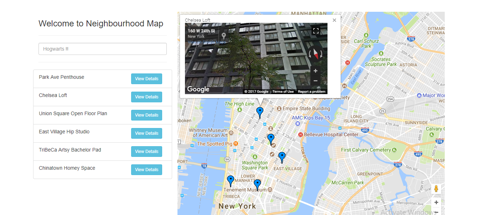

# Neighbourhood-Map Project

# How To Use

1. Clone the repository - https://github.com/Worm4047/neighbourhood-map.git
2. Open Index.html
3. To filter the locations, type in the search box.
4. To view details about any location, click on the view details button.

# Live preview
https://worm4047.github.io/neighbourhood-map/

Future Improvements

I'd like to get add more details to all locations, so as to make it more user friendly.
